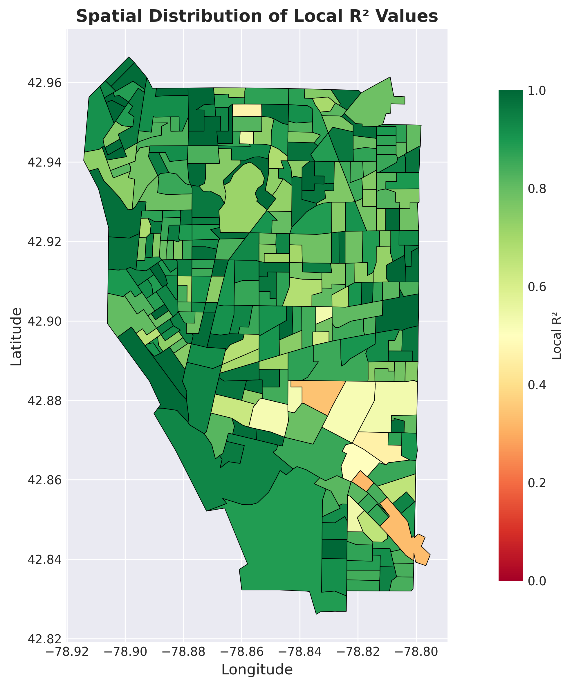
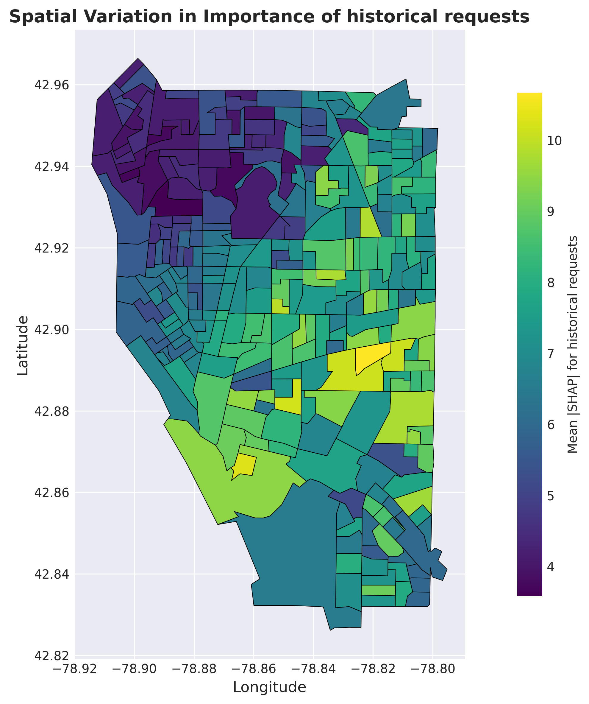

# **GALAX**: A Framework for **G**eospatial **A**nalysis **L**everaging **A**utoML and e**X**plainable AI

[](https://www.python.org/downloads/)
[](LICENSE)
[](https://github.com/yourusername/GALAX/releases/tag/v1.0)

## Table of Contents
- [Overview](#overview)
- [Repository Structure](#repository-structure)
- [Required Python Packages](#required-python-packages)
- [Basic Example - Regression](#basic-example---regression)
- [Basic Example - Classification](#basic-example---classification)
- [Visualization Examples](#visualization-examples)
- [Data Attribution](#data-attribution)
- [Data Sources](#data-sources)
- [Contact](#contact)
- [Citation](#citation)
- [Acknowledgments](#acknowledgments)

## Overview

GALAX (**G**eospatial **A**nalysis **L**everaging **A**utoML and e**X**plainable AI) is a novel framework that integrates Automated Machine Learning (AutoML), eXplainable AI (XAI), and Geographically Weighted Regression (GWR) for spatial analysis. GWR is a powerful tool for understanding spatial heterogeneity, but it faces critical limitations: reliance on linear regression restricts its ability to capture non-linear relationships, struggles with high-dimensional feature spaces, and lacks support for classification tasks. While machine learning approaches can address these limitations, they often lack spatial awareness and operate as "black boxes" with limited interpretability. GALAX addresses these challenges by introducing a unified framework that integrates spatially adaptive AutoML with explainable AI capabilities.

GALAX represents a significant methodological advancement through three core innovations:
1. **Spatially Adaptive AutoML**: Automatically selects and optimizes the best machine learning model for each geographic location based on local data characteristics.
2. **Geographically Weighted XAI**: Provides transparent interpretations through SHAP (SHapley Additive exPlanations) at both global and local scales, revealing spatial variations in feature importance and non-linear relationships.
3. **Unified Framework**: Supports both regression and classification tasks within a unified framework.

This repository contains the source code of the GALAX model and example datasets.

## Repository Structure

```
GALAX-aaag/
│
├── galax/                      # Main package directory
│   └── GALAX.py               # Core GALAX implementation
│
├── examples/                   # Jupyter notebook demonstrations
│   ├── regression_demo.ipynb  # Regression analysis with visualizations
│   └── classification_demo.ipynb # Classification analysis with visualizations
│
├── data/                       # Example datasets
│   ├── 311Request.csv         # Buffalo 311 requests (regression)
│   ├── 311Request_class.csv   # Buffalo 311 requests (classification)
│   └── buffalo/               # Buffalo vector map
│       ├── buffalo.shp
│       ├── buffalo.cpg
│       ├── buffalo.dbf
│       ├── buffalo.prj
│       ├── buffalo.sbn
│       ├── buffalo.sbx
│       ├── buffalo.shx
│       └── buffalo.shp.xml
│
├── results/                    # Example output files
│   ├── regression_feature.png
│   ├── regression_r2.png
│   ├── classification_precision.png
│   └── classification_feature.png
│
├── README.md
├── requirements.txt            # Python dependencies
└── LICENSE                     # License information
```

### Folder and File Descriptions

- **`galax/`**: Contains the main GALAX module with all classes and functions for model fitting, bandwidth selection, and result processing.

- **`examples/`**: Interactive Jupyter notebooks demonstrating:
  - How to prepare data for GALAX
  - Model configuration and fitting
  - Performance evaluation
  - Visualization of results

- **`data/`**: Sample datasets from Buffalo 311 call requests for testing and demonstration purposes.

- **`results/`**: Example output files showing the structure of saved GALAX results, including predictions, SHAP values, and performance metrics.

## Required Python Packages

```bash
pip install numpy pandas scikit-learn flaml shap libpysal esda joblib
```

## Basic Example - Regression

```python
import pandas as pd
from sklearn.preprocessing import StandardScaler
from GALAX import GALAX

data = pd.read_csv("data/311Request.csv")

# Prepare features and target
columns_to_exclude = ['CBG ID', 'Lon', 'Lat', '311_requests']
x_vars = [column for column in data.columns if column not in columns_to_exclude]
scaler = StandardScaler()
X = scaler.fit_transform(data[x_vars])
y = data['311_requests'].values.reshape(-1, 1)
coords = data[['Lon', 'Lat']].values

# Configure AutoML settings
automl_settings = {
    "time_budget": 180,
    "estimator_list": ['rf', 'xgboost', 'xgb_limitdepth', 'extra_tree'],
    "task": 'regression',
    "metric": 'r2',
    "seed": 42,
    "verbose": 0,
}

# Initialize and fit GALAX model
model = GALAX(
    coords=coords,
    y=y,
    X=X,
    bw='isa',  # Automatic bandwidth selection
    kernel='bisquare',
    automl_settings=automl_settings,
    task='regression',
    n_jobs=48,
    x_vars=x_vars
)

results = model.fit()
results.summary()
results.save_results('results/GALAX_results.joblib')
```

## Basic Example - Classification

```python
import pandas as pd
from sklearn.preprocessing import StandardScaler
from GALAX import GALAX

data = pd.read_csv("data/311Request_class.csv")

columns_to_exclude = ['CBG ID', 'Lon', 'Lat', '311_requests']
x_vars = [column for column in data.columns if column not in columns_to_exclude]
scaler = StandardScaler()
X = scaler.fit_transform(data[x_vars])
y = data['311_requests'].values
coords = data[['Lon', 'Lat']].values

automl_settings = {
    "time_budget": 180,
    "estimator_list": ['rf', 'xgboost', 'xgb_limitdepth', 'extra_tree'],
    "task": 'classification',
    "metric": 'accuracy',
    "seed": 42,
    "verbose": 0,
}

model = GALAX(
    coords=coords,
    y=y,
    X=X,
    bw='isa',
    kernel='bisquare',
    automl_settings=automl_settings,
    task='classification',
    n_jobs=48,
    x_vars=x_vars
)

results = model.fit()
results.summary()
results.save_results('results/GALAX_results_class.joblib')
```

## Visualization Examples

GALAX provides rich visualization capabilities to understand spatial patterns and model behavior:

### Local Performance Metrics

*Spatial variation in R² across locations*

### SHAP Feature Importance

*local feature importance for the most important feature revealed through SHAP values*

**Note**: See the Jupyter notebooks in `examples/` for more visualizations generated from the Buffalo 311 dataset.

## Data Attribution

The example data used in this repository (Buffalo 311 call requests) is from:

**Sun, K., Zhou, R. Z., Kim, J., & Hu, Y. (2024). PyGRF: An improved Python Geographical Random Forest model and case studies in public health and natural disasters. *Transactions in GIS*, 28(7), 2476-2491.**

## Contact

For questions, suggestions, or collaborations, please contact:

- **Pingping Wang** [pingpingwang@txstate.edu]
- **Dr. Yihong Yuan** [yuan@txstate.edu]

**Future Development: PyGALAX**
We are actively developing **PyGALAX**, an enhanced Python package that will support additional functions. Stay tuned for the PyGALAX release!

## Citation

The full paper describing the methodology, validation, and applications is available online. If you use the code from this repository or from GALAX, we will really appreciate if you can cite our paper:

```bibtex
Wang, P., Yuan, Y., Li, L., & Lu, Y. (2025). GALAX: A Framework for Geospatial Analysis Leveraging AutoML and eXplainable AI. Annals of the American Association of Geographers.
```

## Acknowledgments

Our deep and sincere thanks go to the anonymous reviewers for their constructive comments, which greatly improved the content and clarity of this article. We thank SafeGraph for providing the mobility data used in the analysis. The first author and second author appreciate the support by the Texas State University College of Liberal Arts 2024-2025 Research Seed Grant.
